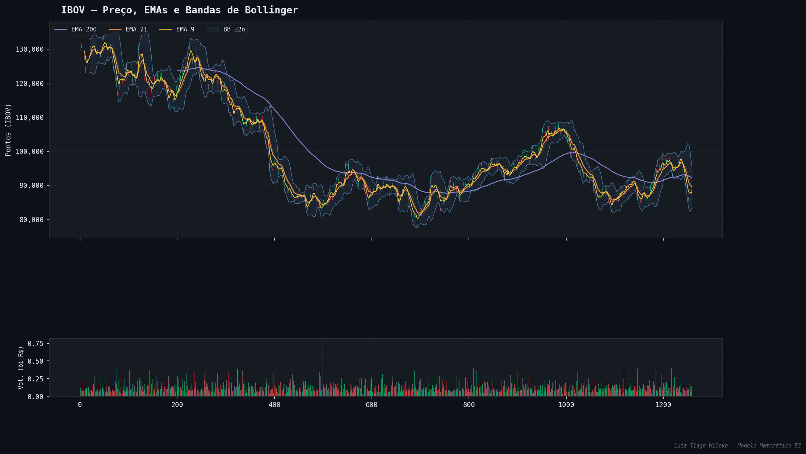
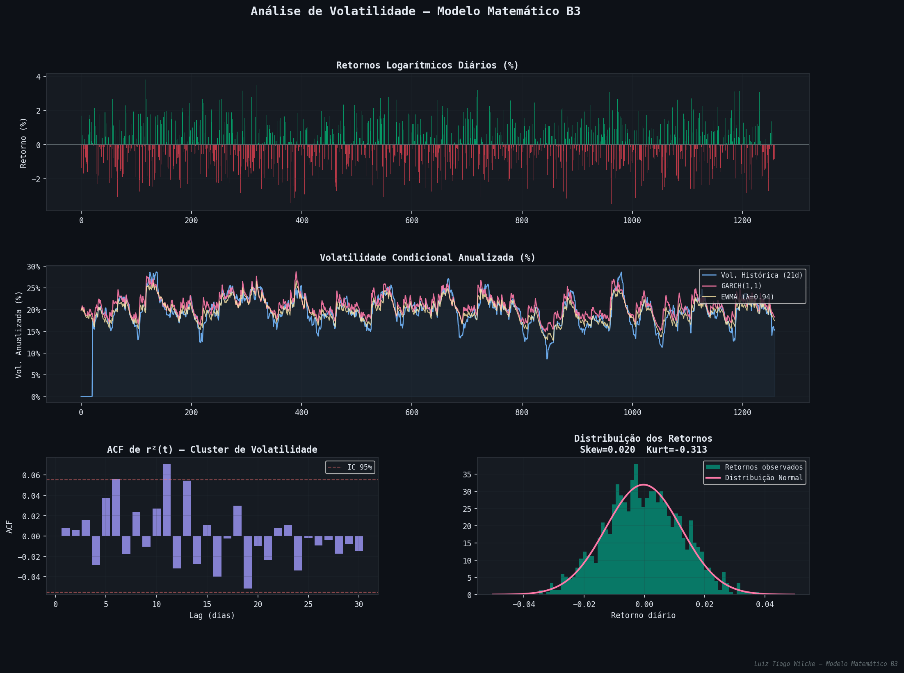
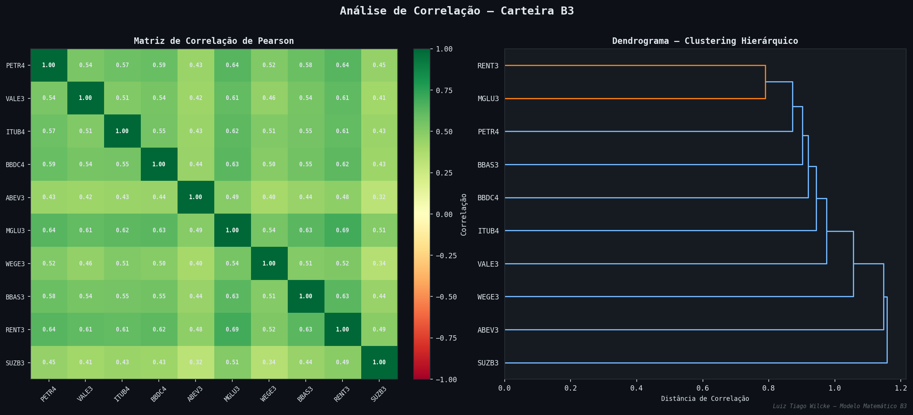

# Modelo Matemático da Bolsa de Valores (B3)

Este projeto consiste em um motor matemático de alto desempenho desenvolvido em **Fortran 90/95/2003** e uma interface de visualização em **Python**. O objetivo é simular e analisar o comportamento de ativos da Bolsa de Valores brasileira (B3) utilizando métodos quantitativos avançados.

## 🏗️ Estrutura do Projeto

O sistema é dividido em 38 módulos Fortran que cobrem:
- Equações Diferenciais (Estocásticas e Ordinárias)
- Modelos de Volatilidade (GARCH, EWMA)
- Análise Técnica (RSI, MACD, Bandas de Bollinger)
- Filtro de Kalman e Processamento de Sinais (Fourier, Ondaletas)
- Análise Fractal e Caos (Hurst, DFA)
- Precificação de Derivativos (Black-Scholes, Heston)
- Otimização de Portfólio (Markowitz, Algoritmos Genéticos)

## 📉 Fundamentos Matemáticos

### Movimento Browniano Geométrico (MBG)
Utilizado para simular a trajetória de preços:
$$ dS_t = \mu S_t dt + \sigma S_t dW_t $$

### Modelo Black-Scholes
Fórmula para o preço de uma opção de compra (Call):
$$ C(S, t) = S_0 N(d_1) - K e^{-r(T-t)} N(d_2) $$
Onde:
$$ d_1 = \frac{\ln(S_0/K) + (r + \sigma^2/2)(T-t)}{\sigma\sqrt{T-t}} $$
$$ d_2 = d_1 - \sigma\sqrt{T-t} $$

### Modelo Heston (Volatilidade Estocástica)
$$ dS_t = \mu S_t dt + \sqrt{\nu_t} S_t dW_t^1 $$
$$ d\nu_t = \kappa(\theta - \nu_t) dt + \xi \sqrt{\nu_t} dW_t^2 $$

### Modelo GARCH(1,1)
$$ \sigma_t^2 = \omega + \alpha \epsilon_{t-1}^2 + \beta \sigma_{t-1}^2 $$

### Razão de Sharpe
$$ S_a = \frac{E[R_a - R_f]}{\sigma_a} $$

## 📊 Visualizações e Resultados

Os gráficos abaixo são gerados automaticamente a partir dos dados processados pelo motor Fortran.

### 📈 Preços e Indicadores Técnicos


### 🌡️ Volatilidade Condicional (GARCH)


### 🕸️ Matriz de Correlação e Clustering


## 🛠️ Como Executar

### 1. Compilação do Motor Fortran
Requer `gfortran` instalado.

```bash
cd fortran
gfortran -O3 -c *.f90
gfortran *.o -o ../bolsa_valores
cd ..
```

### 2. Execução da Simulação
```bash
./bolsa_valores
```
Isso gerará o arquivo `resultados/dados_processados.csv`.

### 3. Geração de Gráficos (Python)
Requer `pandas`, `numpy` e `matplotlib`.

```bash
cd python
python3 graf_01_precos.py
python3 graf_02_volatilidade.py
python3 graf_03_correlacao.py
```

## 📊 Visualizações
Os gráficos gerados estarão disponíveis na pasta `graficos/`.

---
**Autor:** Luiz Tiago Wilcke
**Tecnologias:** Fortran 2003, Python 3.x, Git
